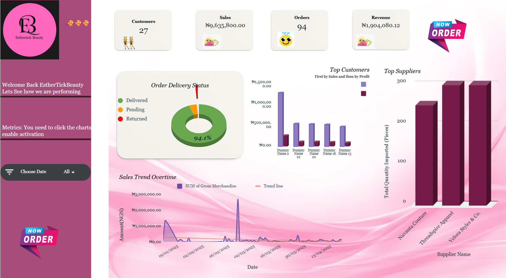

#  Business Tracker Spreadsheet

This is a custom-built, automated Google Sheets dashboard designed as a personal gift to help my best friend confidently launch and manage her small business.

##  Purpose

As she begins her entrepreneurial journey, this spreadsheet is meant to be her all-in-one control center for:

- 📈 **Tracking sales and income**
- 💸 **Recording expenses**
- 📊 **Monitoring financial health**
- 📎 **Storing essential business data**

It’s a personal and practical tool that brings clarity to her numbers, because knowing your numbers is the first step to becoming a better founder.

## Design & Aesthetic

- The spreadsheet uses **a pink theme** to reflect her favorite color, creating a warm, motivating workspace.

##  Features & Automation

- **Dashboard Overview**: Auto-updating charts and summaries of revenue, expenses, and net balance.
- **Sales Log**: Enter transactions with automatic categorization, sales id, customer id,timestamping, automatically calculated gmv , revenue
- **Expense Tracker**: Detailed record of all outgoing funds, auto-sorted by type, all expense are streamlined per piece
- **inventory Tab**: Details of each product/items and its prices, Sellling prices inclusive expenses, profit margin and costprices.
- **Formulas & Automations**:
  - Auto-calculations for profit/loss
  - Dynamic charts and conditional formatting
  - (Add: Apps Script triggers  to capture timestamp for sales)

##  How to Use

1. **Enter sales** in the **Sales** tab.
2. **Log expenses** in the **Expenses** tab.
3. **View insights** in the **Dashboard** tab—this updates automatically.

##  Setup & Access

Download the sheet and its all ready.
Note : the data used here are dummy data.
---

Crafted with love 💗 to support your first steps as a boss!
